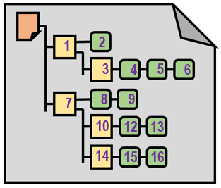

# First Steps

## Lernziele

- FUSEE installieren und bauen
- Was heißt Echtzeit3D?
  - Init und RenderAFrame
- Der Szenengraph
- Kamera und Input

## FUSEE installieren und Bauen

> **TODO**
>
> - Installiert und baut FUSEE wie im 
>   [Getting Started Tutorial](https://github.com/FUSEEProjectTeam/Fusee/wiki/Getting-Started) 
>   beschrieben

## Was heißt Echtzeit?

- Bilder müssen so schnell generiert werden, dass eine flüssige
  Animation möglich ist (aktuell > 30 fps)
- Voraussetzung für Interaktion: Benutzereingaben steuern Parameter der
  Bildberechnung, wie z. B. 
  - Position und Orientierung der Kamera im Raum (First Person)
  - Position, Orientierung und Pose von Charactern (Third Person)

### Grundsätzlicher Aufbau einer Echtzeit-3D-Applikation

```C#
START
  Initialisierung

  WHILE NOT
     Eingabegeräte Abfragen
     Szenenparameter Ändern
     Bild Rendern
  END
END
```

Zu Beginn eines Echtzeit 3D-Programmes weren notwendige Initialisierungen vorgenommen,
wie z.B. Laden von 3D-Modellen, Texturen und anderen _Assets_. Aufbau
eines initialen [Szenengraphen](#der-szenengraph).

Dann begibt sich das Programm in eine "Endlos"-Schleife (die nur durch das
Programmende beendet wird). Jeder Schleifendurchlauf erzeugt ein Bild, daher
muss die Schleifenrumpf schnell genug durchlaufen werden können (Zeit
pro Schleifendurchlauf: < 1/30 sec).

Innerhalb dieses Schleifendurchlaufs wird der Status der Eingabegeräte abgefragt,
auf die die Interaktion reagieren soll. Mögliche Eingabegeräte sind z.B.

- Maus (Position, Status der Tasten)
- Tastaur (Status der Tasten - welche sind gedrückt, welche wieder losgelassen)
- Touchscreen (Position(en) der Touchpoints, Gestenerkennung wie z.B. Pinch)
- Gyroskop, Accelerometer, Kompass (Position und Lage im Raum eines Mobilgerätes)
- Position- und Lagesensor von VR-Brillen

Die Eingaben werden dann in Parameter-Änderungen für das nächste zu rendernde
Bild umgerechnet. Schließlich wird das Bild mit den aktuellen Eingaben gerendert.

Als Autor einer FUSEE-Applikation wird diese Struktur (Initialisierung und anschließende "Endlos"-Schleife) bereits vorgegeben. Den folgenden Code kann
man sich als bereits von FUSEE implementiert vorstellen:

```C#
main()  // FUSEE-Start-Methode
{
   Init();     

   for (;;)
   {
      RenderAFrame();
   }
}
```

Als Programmierer einer FUSEE-Applikation muss man "nur noch" die Methoden 
`Init()` und `RenderAFrame()` mit "Leben" füllen. 

Die Methode `RenderAFrame()` wird also bereits aus einer umgebenden Schleife
aufgerufen!

Die Datei [FirstSteps.cs](Core/FirstSteps.cs) enthält minimale Implementierungen
für die beiden Methoden [`Init()`](Core/FirstSteps.cs#L20) und 
[`RenderAFrame()`](Core/FirstSteps.cs#L27)

> **TODO**
>
> - Öffnet die Solution 'FirstSteps.sln' in Visual Studio
> - Setzt 'FirstSteps.Desktop als Startup-Projekt
> - Setzt 'x86' als Solution Platform
> - Startet die Applikation

Wie man sieht, sieht man nichts - ein Fenster in hellgrün. Das liegt daran, dass
in `Init()` die so genannte _ClearColor_, also die Hintergrundfarbe, mit der
beim Rendern zunächst mal der gesamte zu rendernde Bereich gelöscht wird, auf
hellgrün gesetzt wird. 

In `RenderAFrame()` wird dann für jedes zu rendernde Bild zunächst das gesamte Bild
tatsächlich mit der vorher gesetzten Farbe gelöscht (mit `RC.Clear(...)`) und 
schließlich das im Hintergrund gerenderte Bild, das aus nicht anderem als der 
grünen Fläche besteht, in den sichtbaren Bildbereich gebracht (mit `Present()`).

> **TODO**
>
> - Ändert die Hintergrundfarbe in der [`Init()`-Methode](Core/FirstSteps.cs#L23)

## Der Szenengraph

Objekte, die in der Szene sichtbar sein sollen, werden in einem _Szenengraphen_ 
zu einer Szene zusammengestellt. Einen Szenengraphen kann man sich wie die 
Szenenbeschreibung in Blender's 
[Outliner Editor](https://sftp.hs-furtwangen.de/~mch/computergrafik/script/chapter01/lecture01/#blender-screen-layout)
vorstellen. Das Wort _Graph_ beschreibt den hierarchischen Aufbau, manchmal spricht man auch vom Szenen-_Baum_. Da es in diesen Bäumen vorkommen kann, dass Objekte an mehreren 
Stellen eingehängt sein können, wird der hier mathematisch passendere Begrif _Graph_ verwendet.

In FUSEE besteht ein Szenengraph aus Instanzen der folgenden Datentypen

- [`SceneContainer`](https://github.com/FUSEEProjectTeam/Fusee/blob/develop/src/Serialization/SceneContainer.cs#L41)
- [`SceneNodeContainer`](https://github.com/FUSEEProjectTeam/Fusee/blob/develop/src/Serialization/SceneNodeContainer.cs#L12)
- [`SceneComponentContainer`](https://github.com/FUSEEProjectTeam/Fusee/blob/develop/src/Serialization/SceneComponentContainer.cs#L36)

Um diese Typen zu verstehen, ist im folgenden Bild ein Beispiel-FUSEE-Szenengraph abgebildet



Eine Szene beginnt immer mit einem Objket vom Typ `SceneContainer` (orange). Dieser enthält
eine Liste von Objekten vom Typ `SceneNodeContainer` (gelb). Diese stellen die 
Objekte in der Szene dar. Wie man sehen kann, können Objekte wiederum Kind-Objekte 
enthalten. D.h. jeder `SceneNodeContainer` enthält eine (u.u. leere) Liste, wiederum von 
Objekten vom Typ `SceneNodeContainer`. Die eigentlichen Nutzdaten sind dann in 
`SceneComponentContainer` Objekten (grün) gespeichert. Hier gibt es unterschiedliche
Komponenten-Typen. Die wichtigsten sind

- [`MeshComponent`](https://github.com/FUSEEProjectTeam/Fusee/blob/develop/src/Serialization/MeshComponent.cs#L10) - enthalten 3D-Geometriedaten wie Punkte, Flächen, Normalen und UVs.
- [`MaterialComponent`](https://github.com/FUSEEProjectTeam/Fusee/blob/develop/src/Serialization/MaterialComponent.cs#L80) - enthalten Materialbeschreibungen und Textur-Informationen.
- [`TransformComponent`](https://github.com/FUSEEProjectTeam/Fusee/blob/develop/src/Serialization/TransformComponent.cs#L10) - enthalten Positions-, Orientierungs- und Skalierungs-Informationen für die jeweilige Node.

### Ein Würfel

> **TODO**
>
> - Fügt in die Klasse [`FirstSteps`](Core/FirstSteps.cs#L27) die beiden Felder
>   - `_scene` und
>   - `_sceneRenderer` 
>  ein.

```C#
    public class FirstSteps : RenderCanvas
    {
        private SceneContainer _scene;
        private SceneRenderer _sceneRenderer;
```
> - Erweitert die Methode [`Init()`](Core/FirstSteps.cs#L20) wie folgt, um einen
>   Szenengraphen erzeugt, dessen einziges Objekt ein Würfel ist. Zusätzlich wird 
>   der so genannte `SceneRender` erzeugt, der jede beliebige Szene rendern kann.

```C#
  public override void Init()
  {
      // Set the clear color for the backbuffer to white (100% intentsity in all color channels R, G, B, A).
      RC.ClearColor = new float4(0.7f, 1, 0.5f, 1);

      // Create a scene with a cube
      // The three components: one XForm, one Material and the Mesh
      var cubeTransform = new TransformComponent {Scale = new float3(1, 1, 1), Translation = new float3(0, 0, 50)};
      var cubeMaterial = new MaterialComponent
      {
          Diffuse = new MatChannelContainer {Color = new float3(0, 0, 1)},
          Specular = new SpecularChannelContainer {Color = float3.One, Shininess = 4}
      };
      var cubeMesh = SimpleMeshes.CreateCuboid(new float3(10, 10, 10));

      // Assemble the cube node containing the three components
      var cubeNode = new SceneNodeContainer();
      cubeNode.Components = new List<SceneComponentContainer>();
      cubeNode.Components.Add(cubeTransform);
      cubeNode.Components.Add(cubeMaterial);
      cubeNode.Components.Add(cubeMesh);

      // Create the scene containing the cube as the only object
      _scene = new SceneContainer();
      _scene.Children = new List<SceneNodeContainer>();
      _scene.Children.Add(cubeNode);

      // Create a scene renderer holding the scene above
      _sceneRenderer = new SceneRenderer(_scene);
  }
```
> - Fügt in die Methode [`RenderAFrame()`](Core/FirstSteps.cs#L27) den Aufruf
    `_sceneRenderer.Render(RC);` ein. Diese führt dazu, dass jeden Frame der Würfel
    gerendert wird.

```C#
  public override void RenderAFrame()
  {
      // Clear the backbuffer
      RC.Clear(ClearFlags.Color | ClearFlags.Depth);

      // Render the scene on the current render context
      _sceneRenderer.Render(RC);

      // Swap buffers: Show the contents of the backbuffer (containing the currently rendered farame) on the front buffer.
      Present();
  }
```
> - Lasst das Programm laufen: Es sollte die Seitenansicht eines blauen Würfels
>   auf grünem Untergrund erscheinen.

Um den Code zu verstehen, ist es am besten, ein wenig damit herumzuspielen:

> **TODO**
>
> - Ändert die Farbe des Würfels
> - Ändert Position, Drehung, Skalierung des Würfels
> - Macht aus dem Würfel einen nicht-würfelförmigen Quader. Es gibt zwei Möglichkeiten - welche?
> - Setzt einen Breakpoint auf die Zeile `_sceneRenderer = new SceneRenderer(_scene);` und
>   betrachtet den Inhalt von `_scene` im Watch-Fenster. Verfolgt den hierarchischen Aufbau der 
>   Szene.


