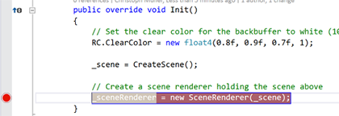
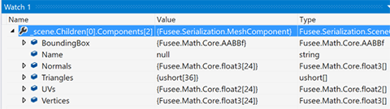
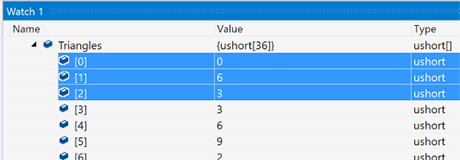
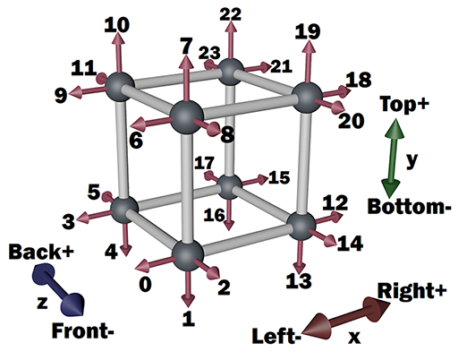
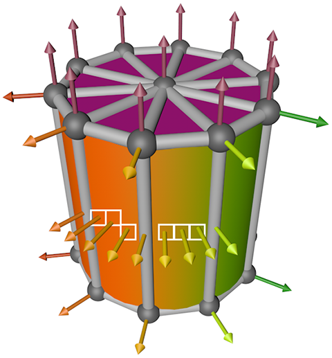
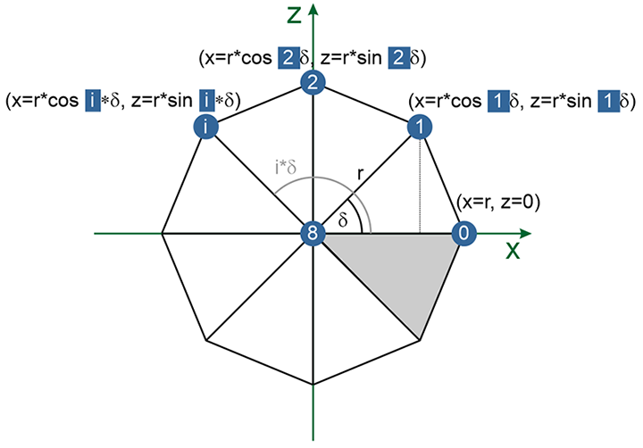

# Mesh

## Lernziele

- Mesh als Geometrie-Bausteine verstehen
  - Aufbau einer Mesh-Komponente
  - Algorithmisch Meshes erzeugen
  - Interaktiv und iterativ einen Algorithmus zur Erzeugung von Geoemtrie entwickeln.

## Meshes

In der Solution Mesh.sln wird ein einzelner rotierender Würfel wird angezeigt. 

> **TODO** Zur Wiederholung/Übung/ zum Verständnis:
> 
> - Identifiziert den Teil, der die Würfelanimation (Rotation) implementiert
>   - Was macht die Methode 
>      [`M.MinAngle()`](https://github.com/FUSEEProjectTeam/Fusee/blob/develop/src/Math/Core/M.cs#L429)?
>      Warum wird sie aufgerufen? 
> - An welcher Position und welcher Orientierung steht die Kamera? Die Anweisungen
>   ```C#
>   // Setup the camera 
>   RC.View = float4x4.CreateTranslation(0, 0, 40) * float4x4.CreateRotationX(-(float) Atan(15.0 / 40.0));
>   ```
>   beschreiben von links nach rechts und jeweils mit negativ zu interpretierenden Parametern die Transformationen,
>   die auf die Kamera ausgeführt wird, und zwar ausgehend von einer Kamera im Koordinaten-Ursprung `(0, 0, 0)`,
>   die entlang der positiven Z-Achse schaut. Rotationen beziehen sich dabei immer auf den Koordinaten-Ursprung
>   und NICHT etwa auf den Mittelpunt der (ggf. bereits verschobenen) Kamera.
>
>   - Welchem Winkel in Grad entspricht [`Atan(15.0 / 40.0)`](https://msdn.microsoft.com/de-de/library/system.math.atan(v=vs.110).aspx)?
>   - Zeichnet Position und Orientierung der Kamera und die Position des Würfels in einer Seitenansicht 
>     (Y-Z-Achsen) des Weltkoordinatensystems auf.

Der Würfel wird, wie in den vorangegangenen Beispielen auch, als ein Objekt vom Typ 
[`MeshComponent`](https://github.com/FUSEEProjectTeam/Fusee/blob/develop/src/Serialization/MeshComponent.cs#L10)
in die Komponentenliste eingehängt. Diese Komponente wird, gleich mit würfelförmiger Geometrie befüllt, von der
Methode `SimpleMeshes.CreateCuboid(new float3(10, 10, 10))` erstellt und zurückgegeben. 
Wir wollen uns ansehen, woraus die Würfel-Geometrie besteht.

> **TODO**
>
> - Schaut Euch die Implementierung von 
>   [`SimpleMeshes.CreateCuboid()`](https://github.com/griestopf/ComputergrafikMIB/blob/master/10_Mesh/Core/SimpleMeshes.cs#L11
)
>    an. _Tipp:_ Ihr könnte mit gedrückter `Strg`-Taste direkt im Visual Studio Editor auf den Methodenaufruf klicken.
> - Seht Euch den Inhalt der Mesh-Komponente im Debuggeran:
>   - In der Methode `Init()`: Setzt einen Breakpoint in die nächste Zeile unter den Aufruf von `_scene = CreateScene();`
>
>     
>
>     Dazu einfach mit der Maus in der grauen Spalte vor der entsprechenden Zeile klicken.
>
>   - Startet den das Programm wie üblich im Debugger über den grünen "Play"-Button (im Desktop Build).
>     *Ergebnis*: Der Programm-Ablauf hält am roten Breakpoint an.
>   - Öffnet das Watch-Fenster des Debuggers (Menü->Debug->Windows->Watch->Watch 1) und fügt als zu beobachtende
>     Variable folgenden Ausdruck ein: `_scene.Children[0].Components[2]`. Es soll also die als **drittes**  
>     (Null-basierter Index; **2**) eingefügte Komponente des **ersten** Kindes (Null-basierter Index; **0**)
>     unserer Szene beobachtet werden. Das ist natürlich die Mesh-Komponente.
>
>     
>
>   - Diese enthält diverse Arrays, u.A: `Vertices`, `Normals` und `Triangles`. Klappt
>     die Arrays im Watch-Fenster auf und seht Euch die Inhalte an. Vergegenwertigt Euch, dass dies
>     das Resultat des Aufrufs von 
>     [`SimpleMeshes.CreateCuboid()`](https://github.com/griestopf/ComputergrafikMIB/blob/master/10_MeshAndPick/Core/SimpleMeshes.cs#L11
)
>     ist.

### Vertices

Wir wollen nun verstehen, wie diese Daten einen Würfel erzeugen. Zunächst mal betrachten wir den Inhalt 
des `Vertices` Array. Wie uns der Name sagt, sind das die Eckpunkte unserer Geometrie, an denen die Flächen
aufgehängt sind. Wie wir sehen, sind dort 3D-Positionen angegeben und diese liegen alle 5 Einheiten
in jeweils beide möglichen Richtungen entlang jeder Hauptachse (x, Y und Z) vom Ursprung entfent. 

Damit liegen wohl alle Punkte an den Eckpunkten eines Würfels mit dem Zentrum in `(0, 0, 0)` und der Kantenlänge 10
(jeweils von -5 bis 5 - so haben wir es ja im Aufruf von `SimpleMeshes.CreateCuboid(new float3(10, 10, 10))`
angegeben).

> **TODO**
> - Falls das nicht klar ist, zeichnet ein paar der Vertices in ein 3D-Koordinatensystem ein.

Eine Frage stellt sich jedoch: Warum sind es 24 Array-Einträge? Ein Würfel hat doch nur 8 Eckpunkte und dies
ist auch die Anzahl der überhaupt möglichen unterschiedlichen Eckpunkte mit den Koordinaten "Betrag von 5 in
allen Dimensionen". Wie wir an den Array-Einträgen sehen, existiert jeder Eckpunkt dann auch drei mal.

Diese Frage, warum hier offenbar drei mal soviel Eckpunkte angegeben sind wie notwendig, klären wir unten, 
wenn es um Normalen geht. 

### Triangles

FUSEE versteht nur Meshes, die aus Dreicken aufgebaut sind. Sollen Flächen mit mehr Eckpunkten dargestellt
werden, müssen diese aus Dreiecken zusammengepuzzelt werden. Da ein Würfel aus sechs Quadraten besteht, muss
jedes Quadrat aus zwei Dreiecken gebildet werden. Der Array `Triangles` enthält die Information, welche Eckpunkte
mit welchen anderen Eckpunten im `Vertices`-Array Dreiecke bilden. Dazu wird der Inhalt des `Triangles` 
folgendermaßen interpretiert:

- Der Array enthält 36 Einträge, allerdings keine 3D-Koordinaten, sondern Ganzzahl-Werte 
  ([`ushort`](https://docs.microsoft.com/de-de/dotnet/articles/csharp/language-reference/keywords/ushort),
  ähnlich wie `int`). 
  Wie man sieht, liegen diese Arrayeinträge im Bereich [0..23]. Diese Zahlen sind Indizes in den `Vertices`
  Array (und in den `Normals` Array, aber dazu später mehr...).
- Jeweils drei aufeinanderfolgende Indizes im Array bilden ein Dreieck, d.h. die ersten drei Einträge,
  `0`. `6` und `3` bedeuten, dass die an Positionen 0, 6, und 3 im `Vertices`-Array-abgespeicherten Eckpunte
  ein Dreieck bilden. Dann kommen im `Triangles` array die drei Einträge `3`, `6` und `9`. Somit bilden 
  die drei Punkte, die man an diesen Indizes im `Vertices`-Array findet, den nächsten Eintrag.

  

> **TODO**
> - Zeichnet die ersten vier im `Triangles`-Array angegebenen Dreiecke (d.h. die ersten 12 Einträge verwenden!)
>   in ein 3D-Koordinatensystem ein.

Damit ist klar, dass die 36 Einträge insgesamt 12 Dreiecke (12 * 3 = 36) aufspannen. Das sind genau zwei Dreiecke, 
um jede der sechs quadratischen Würfelflächen darzustellen.

### Normals

Wie bereits in 
[Lektion 4](https://sftp.hs-furtwangen.de/~mch/computergrafik/script/chapter04/lecture01/)
klar wurde, wird die Farbgebung der Oberflächen über
Normalenvektoren beeinflusst. Diese geben die Ausrichtung der Fläche im Raum an. Um gerundete Oberflächen
zu simulieren (indem kontinuierliche Farbverläufe wie bei gerundeten Flächen errechnet werden),
werden Normalen nicht pro Fläche oder pro Dreieck angegeben, sondern pro Eckpunkt. Somit enthält der 
`Normals` Array genauso viel Einträge, wie der `Vertices` Array (nämlich 24). Korrespondierende Indizes in 
beiden Array liefern die Koordinate und die Normale eines Eckpunktes. Da ein Würfel nicht aus gerundeten
sondern aus ebenen Flächen besteht, die an deutlich sichtbaren Kanten aufeinander stoßen sollen, muss jeder
Eckpunkt drei mal vorhanden sein, und zwar mit unterschiedlichen Normalen. Nur so können im 
`Triangles`-Array Eckpunkte indiziert werden, die für die jeweilige Flächenausrichtung die passende Normale
besitzen. Folgende Skizze verdeutlicht den Aufbau des Würfels aus Eckpunkten und Normalen und gibt die Indizes 
der Eckpunkte jeweils mit unterschiedlichen Normalen wieder.



> **TODO**
>
> - Sucht beliebige Indizes im 'Triangles'Array, findet jeweils den damit identifzierten Eckpunt im 'Vertices'-Array 
>   und die dazugehörende Normale im `Normals`-Array und vergleicht die Zahlenwerte mit der Skizze.

### UVs

Wie auch in Blender heißen Texturkoordinaten in FUSEE `UVs`.  Auch diese werden für jeden Eckpunkt angegeben. In dieser
Lektion spielen Texturkoordinaten zunächst keine Rolle.

## Ein eigenes Mesh

In der Aufgabe am Ende soll die Methode 

```C#
SimpleMeshes.CreateCylinder(float radius, float height, int segments)
```

implementiert werden. Diese soll eine Mesh-Komponente in Form eines Zylinders erzeugen.
Eine Dummy-Implementierung existiert bereits in der Datei 
[SimpleMeshes.cs](Core/SimpleMeshes.cs#L157).
Im Unterschied zum Würfel ist die Mantelfläche des Zylinders gerundet. Das hat folgende Konsequenzen:

- Die Mantefläche kann nur aus endlich vielen Segmenten bestehen. Die Anzahl der Segmente soll aber 
  durch den Benutzer vorgegeben werden. Somit müssen sowohl die Mantelfläche als auch die beiden
  Deckflächen mit Hilfe einer Schleife erzeugt werden, bei der die Anzahl der Durchläufe durch den 
  Parameter `segments` bestimmt wird.
- Die Normalen rund um die Mantefläche müssen zu einem kontinuierlichen (_smooth_) Shading führen

Das Bild aus Lektion 4 verdeutlicht noch mal den Aufbau eines Zylinders.



Bis auf die beiden Mittelpunkte der Deckflächen müssen alle Eckpunkte doppelt angegeben werden, da sie jeweils
Bestandteil zweier unterschiedlicher Flächen mit unterschiedlichen Ausrichtungen (Normalen) sind.

Zunächst soll ein Algorithmus entwickelt werden, der eine kreisförmige Deckfläche des Zylinders als Fächer von 
Dreiecken aufspannt. Die Anzahl der Dreiecke - die Segmente, die später die tortenstückartigen Einzelteile des Zylinders
werden - soll dabei vom Benutzer bestimmt werden. 

Die folgende Skizze soll uns helfen, den Algorithmus aufzubauen.



> **TODO**
>
> - Vergegenwärtigt Euch mit Hilfe der Skizze folgende Sachverhalte (diese sollten verstanden sein)
>   - Das Beispiel erzeugt acht Segmente (der Parameter `segments` wäre hier also 8.
>   - Wir schauen von oben auf die X-Z-Ebene. Das Beispiel soll also zunächst die obere Deckfläche erzeugen. 
>   - Die Kreisfläche soll ihren Mittelpunkt bei (0, 0, 0) haben. 
>   - Der Radius ist durch den Parameter `radius` beim Methodenaufruf gegeben und ist in der Skizze mit `r` benannt.
>   - Der Kreis wird in `segments` (hier 8) Teile unterteilt. Jedes "Kuchenstück" spannt einen Winkel von 
>     360°/`segments`, bzw. im Bogenmaß: 2π/`segments` auf. Dieser Wert wird in der Skizze mit Delta (δ) benannt.
>     Wieviel Grad beträgt δ, wenn, wie in der Skizze, `segments` == 8?
>   - Ein Punkt auf dem Kreis an einem beliebigen Winkel α von der X-Achse aus gemessen hat folgende Koordinaten:
>     - x: r * cos α
>     - z: r * sin α
>
>     Erklärung: Wenn man das Lot vom Punkt auf die X-Achse zeichnet, ergibt sich ein rechtwinkliges Dreieck.
>     Das ist für Punkt 1 in der Skizze als gestrichelte Linie eingezeichnet. In diesem Dreieck ist
>     der Radius die Hypothenuse und die x- und z-Koordinaten sind die Katheden. Die Formel gilt nicht nur
>     im ersten Quadranten des Koordinatensystems, sondern in allen vier, also auch bei Winkeln α > 90°!
> - Zeichnet die für noch nicht blau markierten Vertices deren Indizes in die Skizze ein.
> - Rechnet für ein paar der Punkte deren Koordinaten nach o.g. Formel aus.
> - Zeichnet eine vergleichbare Skizze mit einem anderen Wert als 8 für `segments`, z.B. 5, 6, 7 oder 9. Wie groß
>   ist dann δ?
 
Es ist klar, dass das Erstellen der Punkte in einer Schleife stattfinden muss, denn zur Compilezeit der Methode ist nicht
bekannt, wie groß der Parameter `segments` sein wird. Wir verwenden eine Schleife mit einer Zählvariablen `i`, die 
nicht - wie sonst üblich - bei 0 losläuft, sondern bei 1. Der letzte Schleifendurchlauf läuft für `i == segements-1`, 
in unserem Beispiel läuft die Schleife also sieben mal, mit i von 1 bis einschließlich 7. In der Skizze ist `i` jeweils
als weiße Zahl auf blauem Grund angegeben. 

> **TODO**
> 
> - Beginnt die Implementierung von `CreateCylinder` wie folgt:
>
>  ```C#
>    public static MeshComponent CreateCylinder(float radius, float height, int segments)
>    {
>        for (int i = 1; i < segments; i++)
>        {
>        }
>
>        return new MeshComponent
>        {
>        };
>    }
>  ```
>

Noch passiert in der Schleife nichts. Ebenso ist die zurückgegebene Mesh-Komponente noch leer. Was wir
bereits wissen, ist, dass wir bei n Segmenten n+1 `Vertices` benötigen (denn der Mittelpunkt kommt noch dazu.
In der Skizze ist `segments` 8 und es gibt 9 Vertices inklusive Mittelpunkt). Für die Dreiecksflächen 
benötigen wir im `Triangles`-Array drei Indizes pro Fläche, insgesamt sind es also `segments * 3` Einträge
im `Triangles`-Array. Schließlich muss es noch genau gleich viele Einträge im `Normals`-Array wie im 
`Vertices`-Array geben.

> **TODO**
> 
> - Legt am Anfang der Methode (_vor_ der Schleife) drei Arrays an, in denen die Vertices, die Triangles-Indizes 
>   und die Normalen gespeichert werden.
>
>  ```C#
>    float3[] verts = new float3[segments+1];    // one vertex per segment and one extra for the center point
>    float3[] norms = new float3[segments+1];    // one normal at each vertex
>    ushort[] tris  = new ushort[segments * 3];  // a triangle per segment. Each triangle is made of three indices
>  ```
>
> - Tragt am Ende der Methode diese Arrays als die aktuell zurückzugebenden Einträge der neuen 
>   Mesh-Komponente ein:
>
>  ```C#
>   return new MeshComponent
>   {
>       Vertices = verts,
>       Normals = norms,
>       Triangles = tris,  
>   };
>  ```

Die Schleife läuft bei 1 los (und nicht bei 0), da wir pro Schleifendurchlauf jeweils nicht nur die Koordinaten
des jeweiligen Punktes mit dem Index `i` errechnen wollen, sondern auch gleich den `tris`-Array mit Indizes für 
das jeweilige Segment füllen wollen. Für das erste Segment, das aus den Indizes `8`, `0` und `1` besteht, muss 
aber der Punkt mit dem Index 0 bereits bestehen. Deswegen muss _vor_ der Schleife (und _nach_ dem Erzeugen der
Arrays), noch ein wenig Initialisierungsarbeit geleistet werden.

> **TODO**
>
> - Errechnet zunächst vor der Schleife den Winkel δ (im Bogenmaß):
>   ```C#
>      float delta = 2 * M.Pi / segments;
>   ```
>   _Fun Fact_: C#-Datein sind in Unicode gespeicher, d.h. es könnten u.A. auch griechische Buchstaben 
>   als Variablennamen verwendet werden. Folgender Code ginge auch, ist aber unpraktisch, weil schwer zu tippen...
>   ```C#
>      float δ = 2 * M.Pi / segments;
>   ```
>
> - Fügt direkt vor die Schleife die Initialisierung des letzten Punktes im Array ein, der immer im 
>   Koordinatenursprung `(0, 0, 0)` oder `float3.Zero` liegt. Die Normalen _aller_ Eckpunkte der oberen
>   Deckfläche zeigen "nach oben", also entlang der positiven Y-Achse (`(0, 1, 0)` oder `float3.UnitY`).
>
>   ```C#
>      // The center (store at the last position in the vertex array (index 'segments'))
>      verts[segments] = float3.Zero;
>      norms[segments] = float3.UnitY;
>   ```
>  
>  - Da die Schleife bei 1 (und nicht bei 0) losgeht: Fügt - ebenfalls vor der Schleife - die die Initialisierung
>    des Punktes 0 ein. Dieser liegt auf der X-Achse (d.h. `z`= 0) mit dem Abstand `radius` vom Nullpunkt. Auch
>    dieser Punkt braucht eine Normale:
>
>    ```C#
>      // The first and last point (first point in the list (index 0))
>      verts[0] = new float3(radius, 0, 0);
>      norms[0] = float3.UnitY;
>    ```
>    Dieser Punkt 0 wird gleichzeitig auch Bestandteil des letzten Kuchenstücks, aber dazu später mehr.

Jetzt können wir in der Schleife die Koordinaten aller Punkte von 1..segements-1 (in der Skizze von 1 bis 7) errechnen
und diese im `verts`-Array jeweils an der Stelle `i` abspeichern.

> **TODO**
>
> - Fügt die Berechnung der Koordinaten für Punkt `i` in den Schleifenrumpf ein
>
>   ```C#
>   for (int i = 1; i < segments; i++)
>   {
>       // Create the current point and store it at index i
>       verts[i] = new float3(radius * M.Cos(i * delta), 0, radius * M.Sin(i * delta));
>       norms[i] = float3.UnitY;
>   }
>   ```

Damit sollte die Methode alle benötigten Punkte und Normalen an die richtigen Stellen in den Arrays `Normals`
und `Vertices` unserer Mesh-Komponente eintragen. Natürlich wird noch keine sichtbare Geoemetrie erzeugt, denn
die Information, welche Punkte mit welchen anderen Punkten zu Dreiecken zusammengefasst werden, fehlt noch.

Wir können aber mit dem Debugger überprüfen, ob soweit alles stimmt:

> **TODO**
>
> - In der Methode Ersetzt den Aufruf von 


      


