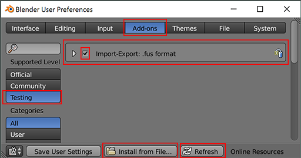
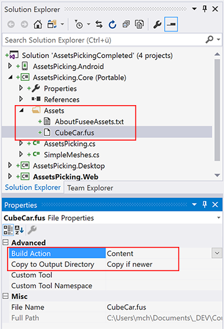
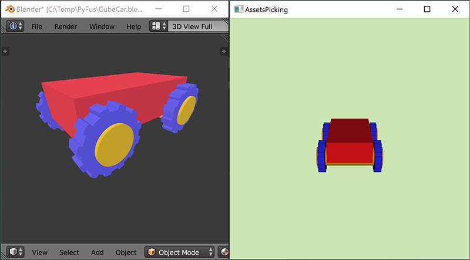
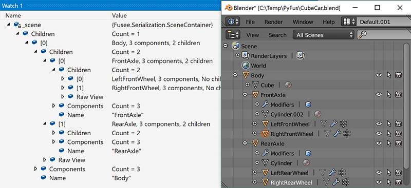

# Assets & Picking

## Lernziele

- Mit Blender 3D-Modelle erstellen und in FUSEE darstellen
- Auf Einzelteile einer 3D-Szene zugreifen und verändern
- Suchen nach Namen in Szenengraphen
- Picking: Auf Objekte klicken

## Voraussetzung: FUSEE-Export-AddOn für Blender

In diesem Kapitel sollen 3D-Geometrien (Meshes) nicht mehr durch Code erzeugt werden, sondern als Modelle,
die mit Blender erstellt wurden, geladen werden können. 

Hierarchien im bereits bekannten FUSEE-Szenengraphen-Format (bestehend aus Nodes und Komponenten)
können als `.fus`-Dateien gespeichert und geladen werden. 

Um mit Blender erstellte 3D-Modelle als .fus-Datei zur Verwendung in FUSEE-Applikationen zu verwenden, muss das 
FUSEE-Export-AddOn für Blender installiert werden. Dies erfordert im derzeitigen Entwicklungszustand noch ein
paar Handgriffe. Folgende Schritte sind nötig:

1. Python Vollversion installieren.

   - Den aktuellen [Python 3 Installer downloaden](https://www.python.org/downloads/release/python-361/), z.B. für 
     Windows den [x86-64 web-based installer](https://www.python.org/ftp/python/3.6.1/python-3.6.1-amd64-webinstall.exe).
   - Installation starten.
   - ***Während der Installation die Option "Add Python 3.x to PATH" aktivieren!!!***
   - Zur Kontrolle die Kommandozeile mit "Windows-Taste -> `cmd`" aufrufen und `python` eintippen.
     - Falls keine Fehlermeldung erscheint, ist Python mit allen Pfad-Angaben installiert.
     - `quit()` eingeben.

2. Das Python-**Protobuf**-Paket installieren

   - Internetverbindung herstellen
   - Kommandozeile noch mal öffnen, falls notwendig
   - `pip3 install protobuf` eingeben

3. Das Python-**Visual-Studio-Debug**-Paket installieren

   - Internetverbindung herstellen
   - Kommandozeile noch mal öffnen, falls notwendig
   - `pip3 install ptvsd` eingeben

4. FUSEE-**fuConv**-Tool in der aktullen Version bereitstellen. Dazu 
   
   ***ENTWEDER (aufwändiger)***

   - Neuste Version von FUSEE downloaden (als .zip oder per GitHub Desktop)
   - Die Solution "Fusee.Engine.SceneViewer.sln" öffnen
   - Im Soulution-Explorer mit der rechten Maustaste auf das Projekt "Tools/fuConv" klicken und
     "Build" ("Erstellen") klicken.

   ***ODER (einfacher)***

   - [Tools.zip](https://sftp.hs-furtwangen.de/~mch/computergrafik/_blenderaddon/Tools.zip) herunterladen
   - Inhalt mit 7zip entpacken ***NICHT MIT WINDOWS-ZIP!!!***
   - Enhaltenden Tools-Ordner komplett mit allen Unterverzeichnissen nach %FuseeRoot%\Bin\Debug\Tools
     kopieren.
   - Inhalt eines ggf. schon vorhandenen %FuseeRoot%\Bin\Debug\Tools Ordners mit dem aus dem Zip-File
     integrieren/ersetzen.

5. Das FUSEE-Blender-AddOn installieren

   - AddOn-Zip-Datei [io_export_fus.zip](https://sftp.hs-furtwangen.de/~mch/computergrafik/_blenderaddon/io_export_fus.zip)  herunterladen.
   - Blender starten
   - Den User-Preferences-Dialog öffnen ("File->User Preferences" oder `Ctrl` + `Alt` + `U`)
   - Im "Add-ons"-Tab ganz unten auf den Button "Install from File..." klicken.
   - Die heruntergeladene `io_export_fus.zip` auswählen. 
   - Links im Dialog "Testing" als das "Supported Level" auswählen. Ggf. mehrfach "Refresh" Drücken.
     -> Es sollte das "Import-Export: .fus format" AddOn erscheinen. 
   - Mit dem Häkchen aktivieren

    


6. Testen
  
   - In Blender die Standard-Szene (Würfel oder beliebige andere Geometrie) laden.
   - Im Menü "File -> Export -> FUS (.fus)" auswählen
   - In den "Export FUS" Optionen, die Option "Run with Fusees Web-Application" auswählen 
   - Pfad und Dateinamen festlegen
   - "Export FUS" klicken
   - Die aktuelle Blender-Szene sollte als FUSEE-Web-Applikation im Browser geladen und
     dargestellt werden.

### Features des FUSEE-Exporters

Mit dem FUSEE-Export-AddOn für Blender sich lassen einige Features, die in Blender möglich sind,
als FUSEE-Inhalte exportieren. Diese sind:
  
  - Eltern-Kind-Verhältnisse von Blender-Objekten als Hierarchien von `SceneNodeContainer`-Instanzen.
  - Die Namen der Blender-Objekte als `Name`-Eigenschaft des jeweiligen `SceneNodeContainer`-Objektes
  - 3D-Geometrien als `MeshComponent`
    - Eckpunkt-Postitionen (`Vertices`)
    - Normalen (`Normals`) in Abhängigkeit der "Smooth / Flat"-Einstellung
    - Textur-Koordinaten (`UVs`)
    - Flächen aufgeteilt in Dreicecke (`Triangles`)
  - Position, Rotation und Skalierung jeweils relativ zu den Eltern-Einstellungen und 
    zum Koordinaten-Ursprung (Pivot-Point) als `TransformComponent`.
  - Farben aus den Blender-Material-Einstellungen für den ***Cycles-Renderer*** als `MaterialComponent`:
    - Diffuse-Farbe aus der Diffuse BSDF Node
    - Texturen als Input für den Farb-Kanal der Diffuse BSDF Node
    - Specular-Farbe aus der Glossy BSDF Node

Der Exporter funktioniert in zwei Betriebsarten: 

- ***Ohne*** die Option "Run with Fusees Web-Application" kann eine 3D-Szene als 
  .fus-Datei (ggf. mit zugehörigen Texturen im .jpg-Format) exportiert werden. Diese
  Funktionalität verwenden wir im Folgenden, um 3D-Modelle in unserern eigenen FUSEE-Applikationen
  einzubinden und mit selbst geschriebener Interaktion zu versehen.

- ***Mit*** der Option "Run with Fusees Web-Application" wird eine kompletter FUSEE-Web-Viewer
  rund um die 3D-Szene erstellt. Diese Betriebsart eignet sich, um mal schnell das Ergebnis eines
  FUSEE-Exports zu begutachten oder auch um die erstellte Web-Applikation direkt
  auf einen Web-Space zu kopieren. Die Funktionalität der Web-Applikation erlaubt das
  interaktive Drehen und Zoomen des 3D-Modells, enthält aber ansonsten keine weitere Funktionalität.


## Modelle als Assets

Inhalte, die nicht durch Programmierung erstellt sind, heißen in 3D-Echtzeit-Umgebungen
(Game-Engines) meist _Assets_. In einer FUSEE-Applikation können Assets in Form von 
als .fus-Datei expotierten Blender-3D-Szenen folgendermaßen eingebunden werden.

> ***TODO***
> 
> - Erzeugt eine Szene in Blender mit folgenden Features
>
>   - Mindestens zwei Objekte mit selbst-vergebenen Namen
>   - Eltern-Kind-Verhältnisse zwischen den Objketen
>   - Materialien mit Diffuse- und Glossy-BSDF-Nodes im Cycles-Renderer
>
> - Exportiert die Szene als .fus-Datei (ohne die Option "Run with Fusees Web-Application")
> - Kopiert die .fus-Datei in den "Core\Assets" Unterordner Eures FUSEE-Projektes
> - In Visual-Studio: Im Solution-Explorer: Rechts-Klick auf den Assets-Ordner in AssetsPicking.Core.
> - Add -> Add Existing Item. Dann die oben erzeugte .fus-Datei auswählen. 
> - Rechtsklick auf die neu hinzugefügte Assets-Datei: "Properties" anklicken.
> - Im Properties-Fenster: Als "Build Action" die Auswahl "Content" einstellen und
>   bei "Copy to Output Directory" die Option "Copy if newer" auswählen.
>
> 
>

Auf derart hinzugefügte Assets kann in einer FUSEE-Applikation dann mit der Methode
[`AssetStorage.Get<>()`](https://github.com/FUSEEProjectTeam/Fusee/blob/develop/src/Base/Core/AssetStorage.cs#L49)
zugegriffen werden. Der Methode muss dabei in Spitzklammern (`<>`) der Typ und 
in der Methodenparameterliste (`()`) der Name übergeben werden. 

In unserem Fall enthält eine .fus-Datei immer ein Objekt vom Typ `SceneContainer`. 
Der Name des Assets entspricht dem Dateinamen (MIT Dateinamenerweiterung).

> ***TODO***
> 
> - Ersetzt den Aufruf von 
>   ```C#
>     _scene = CreateScene();
>   ```
>   durch
>   ```C#
>     _scene = AssetStorage.Get<SceneContainer>("CubeCar.fus");
>   ```
>   Ersetzt dabei ggf. den Namen "CubeCar.fus" durch den Namen Eurer eigenen Datei.
>
> - Da nun `CreateSchene()` nicht mehr aufgerufen wird, wird auch `_baseTransform` nicht
>   mehr initialisiert. Kommentiert fürs Erste die Zeile
>
>   ```C#
>     // _baseTransform.Rotation = new float3(0, M.MinAngle(TimeSinceStart), 0);
>   ```
>   einfach aus (`//` voranstellen).
>

Nun besteht die Szene aus dem Inhalt der in Blender erzeugten `.fus`-Datei. 



Um näher zu verstehen, wie das FUSEE-Export-AddOn für Blender die Szene erzeugt,
schauen wir uns den Inhalt der .fus-Datei nach dem Laden in der Applikation an.

> ***TODO***
> 
> - Setzt einen Breakpoint HINTER die Zeile, in der das Modell geladen wird.
>   ```C#
>     _scene = AssetStorage.Get<SceneContainer>("CubeCar.fus");
>   ```
>
> - Betrachtet den Inhalt von `_scene` im Watch-Fenster und klappt die Hierarchie auf.
> - Vergleicht die Hierarchie mit der im "Outliner"-Editor von Blender
>
> 
>
> - Seht Euch die Inhalte der Komponenten an
> - Zeichnet eine Skizze Eurer Szene in 
>   der Scene-Node-Components-Notation aus [Kapitel 08 - Der Szenengraph](https://github.com/griestopf/ComputergrafikMIB/tree/master/08_FirstSteps#der-szenengraph)
>   

Um unser Objekt nun interaktiv zu verändern, z.B. Farben, Positionen, Rotationen, wollen wir
auf einzelne Komponenten zugreifen können.

Da wir die Szene nicht mehr im Code selbst erzeugen, müssen wir die Komponenten, auf die 
wir zugreifen wollen, suchen. Das können wir entweder, in dem wir unser Wissen über die 
Hierarchie ausnutzen, um dann z.B. auf das dritte Enkel-Objekt im ersten Kind des fünften
Objektes in der Szene zuzugreifen. 

Einfacher ist es aber, die Objekte über deren Namen zu identifizieren und nach dem Laden 
der Szene einfach die Komponenten in den Objekten, deren Namen wir kennen zu suchen.

Um Beispielsweise auf die Transformkomponente des rechten Hinterrades in o.a. Beispielszene
zuzugreifen, kann diese über folgenden Aufruf in der Szene gesucht und im Feld `_rightRearTransform` abgespeichert werden:

```C#
  private TransformComponent _rightRearTransform;
...
  _rightRearTransform = _scene.Children.FindNodes(node => node.Name == "RightRearWheel")?.FirstOrDefault()?.GetTransform();
```

Die in einer Zeile zusammengesetzte Anweisung besagt in etwa:

- Durchkämme die Hierarchie sämtlicher Objekte in der Szene (`_scene.Children.FindNodes`).
- Suche dabei nach Nodes deren Name "RightRearWheel" lautet (`node => node.Name == "RightRearWheel"`)
- Von den so gefundenen Nodes nimm die erste, falls eine existiert (`.FirstOrDefault()`).
- Liefere die dort enthaltene Transform-Komponente (`.GetTransform()`)

Die seltsam anmutenden "`?.`" Operatoren heißen übrigens _Elvis-Operator_ (warum wohl?) und bedeuten,
dass nur auf das im vorangestellten Aufruf zurückgelieferte Objekt zugegriffen werden soll,
falls auch tatsächlich eines existiert, ansonsten soll `null` zurückgegeben werden.
Falls also gar kein Objekt gefunden wurde, 
das den gesuchten Namen trägt ODER ein Objekt gefunden wurde, dieses aber keine Transform-Komponente 
enthält, resultiert der gesamte Aufruf darin, dass `_rightRearTransform` den Wert `null` zugewiesen
bekommt und nicht etwa in einem Absturz, weil versucht wurde, in einem nicht vorhandenen Objekt eine
Transform-Komponente zu suchen.

## Picking

Eine häufig vorkommende Aufgabe in Echtzeit-3D-Anwendungen ist es, herauszufinden, welche Objekte in 
der 3D-Szene an unter einer bestimmten 2D-Pixelposition auf dem Bildschirm liegt, beispielsweise
dort, wo ein Benutzer gerade mit der Maus hingeklickt oder mit dem Finger eine Touch-Geste vollführt
hat. FUSEE bietet hierzu die Klasse 
[`ScenePicker`](https://github.com/FUSEEProjectTeam/Fusee/blob/develop/src/Engine/Core/ScenePicker.cs#L65)
mit deren Hilfe diese Aufgabe bewerkstelligt werden kann.

Wie der `SceneRenderer` und auch die weiter oben beschriebene `FindNodes()` Methode wird beim Picking
eine Traversierung des Szenengraphs durchgeführt, d.h. alle Nodes und alle notwendigen Komponenten
werden besucht. Während beim Rendern der Besuch dazu führt, dass jede Komponente ihren Beitrag am
zu rendernden Bild leistet und beim Suchen beim Besuch ein Suchkriterium überprüft wird, werden beim 
Picking - ähnlich wie beim Rendern - die Eckpunkte jedes Dreieck der Geometrie in Bildschirm-Koordinaten
umgewandelt, so dass dann ein Punkt-im-Dreieck-Test durchgeführt werden kann.

Wann immer dieser Test positiv ist (Punkt ist im Dreieck), werden eine Reihe von Informationen gesammelt,
die dann vom Benutzer ausgewertet werden können. Zu diesen Informationen gehört:

- Die gerade traversierte Node
- Die gerade traverseirte (Mesh-)Komponente
- Der Index des ersten Punktes des Dreiecks in der `Triangles`-Liste, für das der Punkt-im-Dreieck-Test
  positiv war
- Die so genannten baryzentrischen Koordinaten, die angeben wo exakt innerhalb des Dreiecks der 
  Punkt liegt
- Modell-, View- und Projektionsmatrix, mit denen die Transformation der Modell-Koordinaten in 
  Bildschirmkoordinaten stattfand.

Diese Informationen sind in der Klasse
[`PickResult`](https://github.com/FUSEEProjectTeam/Fusee/blob/develop/src/Engine/Core/ScenePicker.cs#L9)
zusammengefasst.

Mit diesen Informationen lassen sich nicht nur die unter einem Bildschirm-Pixel liegenden 3D-Objekte
identifizieren, diese lassen sich auch entlang der z-Koordinate sortieren, so dass z.B. das am weitesten
vorne liegende Objekt herausgefunden werden kann. Zudem kann auch das Dreieck identifiziert werden, das
getroffen wurde, sowie die exakte Position des "Auftreffpunktes" errechnet werden und zwar in Modell-
Welt- oder Bildschirmkoordinaten.

> ***TODO***
>
> - Erzeugt eine Klassenvariable `private ScenePicker _scenePicker` (analog zum `SceneRenderer`) 
>   und fügt folgenden Code in die Methode `Init()` _nach_ dem Laden der Szene ein:
>   ```C#
>     _scenePicker = new ScenePicker(_scene);
>   ```
> - Fügt folgenden Code in die Methode `RenderAFrame()` ein, NACHDEM die Kamera gesetzt wurde .
>   ```C#
>        // Setup the camera 
>        RC.View = float4x4.CreateTranslation(0, 0, 40) * float4x4.CreateRotationX(-(float) Atan(15.0 / 40.0));
>
>        if (Mouse.LeftButton)
>        {
>            float2 pickPosClip = Mouse.Position * new float2(2.0f / Width, -2.0f / Height) + new float2(-1, 1);
>            _scenePicker.View = RC.View;
>            _scenePicker.Projection = RC.Projection;
>            List<PickResult> pickResults = _scenePicker.Pick(pickPosClip).ToList();
>            if (pickResults.Count > 0)
>            {
>                pickResults.Sort((a, b) => Sign(a.ClipPos.z - b.ClipPos.z));
>                Diagnostics.Log(pickResults[0].Node.Name);
>            }
>        }
>   ```
>
> - Lasst das Programm laufen und schaut im Visual-Studio-Output-Fenster, 
>   wie die Namen der Objekte beim Anklicken durch die `Diagnostics.Log()` Anweisung angezeigt werden.
> - Setzt einen Breakpoint innerhalb des `if`-Zweigs, geht schrittweise mit `F10` durch den Code
>   und versucht, den Code zu verstehen. Hinweise:
>   - Zunächst wird die aktuelle Mausposition, die Pixel-Koordinaten enthält, in so genannte 
>     2D-Clip-Koordinaten umgerechnet. Diese haben den Ursprung in der Mitte des Ausgabefensters und 
>     am Fenster-Rand jeweils 1 (rechts und oben), bzw. -1 (links und unten).
>   - Der Scene-Picker bekommt die aktuelle Projection und View-Matrix mitgeteilt, damit er 
>     aus den Modell-Koordinaten gültige Screen-Koordinaten berechnen kann.
>   - Der Aufruf von `_scenePicker.Pick()` führt die Traversierung durch und liefert eine unsortierte Liste
>     von Pick-Ergebnissen.
>   - Falls die Liste nicht leer ist, wird diese sortiert (`pickResults.Sort()`) und zwar nach der 
>     z-Bildschirm-Koordinate der Pick-Ereignisse. Kleinere z-Werte kommen nach vorne. Das Pick
>     Ereignis mit dem kleinsten z-Wert ist das, was dem Betrachter am nächsten ist.
>   - Das Pick-Ereignis mit dem Index 0, also das vorne liegende, wird ausgegeben (bzw. der Name der
>     zugehörigen Node).

Nun soll das gerade angeklickte Teil mit einer eigenen Farbgebung versehen werden. Dazu kann mit 
der Methode `GetMaterial()` auf die Material-Node des angeklickten Objektes verwiesen werden.

> ***TODO***
>
> - Fügt der App-Klasse folgende zwei Felder ("Klassenvariablen") hinzu:
>   ```C#
>     private PickResult _currentPick;
>     private float3 _oldColor;
>   ```
> - Ersetzt den inneren `if`-Zweig (dort wo ein angeklicktes Objekt festgestellt wurde) komplett durch 
>   folgenden Code:
>
>   ```C#
>     PickResult newPick = null;
>     if (pickResults.Count > 0)
>     {
>         pickResults.Sort((a, b) => Sign(a.ClipPos.z - b.ClipPos.z));
>         newPick = pickResults[0];
>     }
>     if (newPick?.Node != _currentPick?.Node)
>     {
>         if (_currentPick != null)
>         {
>             _currentPick.Node.GetMaterial().Diffuse.Color = _oldColor;
>         }
>         if (newPick != null)
>         {
>             var mat = newPick.Node.GetMaterial();
>             _oldColor = mat.Diffuse.Color;
>             mat.Diffuse.Color = new float3(1, 0.4f, 0.4f);
>         }
>         _currentPick = newPick;
>     }
>    ```
>
> - Überprüft die Lauffähigkeit, indem Ihr die Applikation startet und auf unterschiedliche
>   Objekte Eurer 3D-Szene klickt. Es müssten jeweils die angeklickten Einzelteile durch die
>   Highligt-Farbe `(1, 0.4f, 0.4f)` gekennzeichnet werden.

## Aufgabe

Erstellt ein eigenes 3D-Modell in Blender mit folgenden Anforderungen:

- Ein Fahrzeug mit (mind.) vier Rädern
- Die Räder sollen so strukturiert sein, dass eine Drehung sichtbar ist, also z.B. ein stilisiertes
  Reifenprofil oder Speichern enthalten
- Das Chassis soll einen beweglichen Aufbau enthalten. Mögliche Fahrzeuge sind somit
  - Gabelstapler (Gabel heb- und drehbar)
  - Bagger (Aufbau drehbar, Arm über mehrere Achsen beweglich)
  - Panzer (Kanone dreh und schwenkbar)
  - Mars-Rover (beweglicher Greifarm)
  - ...
- Der Aufbau soll über mindestens zwei hierarchisch in Eltern-Kind-Beziehung stehende Achsen beweglich sein
- Die Hierarchie muss so aufgebaut sein, dass sich durch Drehungen oder Positonsänderungen sinvolle
  Animationen erzugen lassen.

Mit diesem Modell soll dann eine erste Applikation erzeugt werden

- Ladet das Modell ein eine eigene FUSEE-Applikation und sucht die relevanten Komponenten mit `FindNode()` wie oben.
  Speichert die Komponenten in Feldern, so dass aus `RenderAFrame()` darauf zugegriffen werden kann.
- Erzeugt eine Interaktion, die
  - Den Benutzer über Maus-Klicks das zu bewegende Teil auswählen lässt
  - Die Farbe des gerade selektierten Teils verändert
  - Pfeil- oder WASD- Eingaben (oder Teile davon) auf Bewegungen der Achsen des gerade selektierten (Teil-)Objektes legt

- Das Modell soll dann in der darauffolgenden Übung (Lektion 12) mit einer Fahrzeug-Steuerung (Pfeiltasten) versehen
  werden und der Bewegliche Aufbau soll die Grundlage einer (simplen & selbst ausgedachten) Spielidee
  werden. Gerne kann jetzt schon auf diese zukünftige Anforderungen der kommenden Lektion 12 Rücksicht genommen werden.


 


