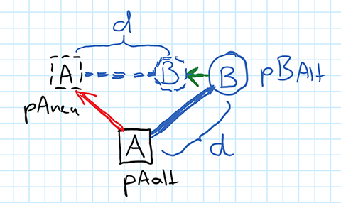

# Driving

## Lernziele

- Verstehen, wie ein Objekt in der Ebene interaktiv fortbewegt werden kann
- Bewegung von Objekten synchronisieren, um Realität zu erzeugen
- Kamerverfolgung mit Tractor-Trailer

In dieser Lektion gibt es keinen Beispielcode. Die Implementierung setzt auf den individuellen
Ergebnissen der Aufgabe der vorangegangenen Lektion 11 auf: Die Fahrzeuge sollen durch
Benutzereingaben steuerbar werden und die Kamera soll dem Fahrzeug auf einem unsichtbaren
Anhänger folgen.

## Spielfigur-Kontrolle

In vielen Echtzeit-3D-Anwendungen soll ein Objekt in der Ebene bewegt werden können. Dabei
sollen interaktiv Richtung und Geschwindigkeit in der aktullen Richtung steuerbar sein.

Z.B. soll eine Figur durch die `W` und `S` nach vorne bzw. nach hinten entlang der
aktuellen Blickrichtung gesteuert werden und die aktuelle Blickrichtung mit den Tasten
`A` und `D` verändert werden können.

Das kann folgendermaßen implementiert werden:

- Die "Achse" `W`/`S` steuert die Positions-Geschwindigkeit der Figur `float posVel`  
  entlang der aktuellen Bewegungsrichtung (Ausrichtung in der X-Z-Ebene). 

- Die "Achse" `A`/`D` steuert die Rotations-Geschwindigkeit der Figur um die Y-Achse
  `float rotVel`.

Pro Frame wird dann zunächst die Orientierung der zu steuernden Figur um den
gerade in `rotVel` enthaltenen Wert erhöht oder erniedrigt.

```C#
  float newYRot = _carTrans.Rotation.y + rotVel;
  _carTrans.Rotation = new float3(0, newYRot, 0);
```

> ***TODO***
>
> - Zeichnet eine Skizze eines Objektes im 3D-Koordinatensystem und zeichnet dessen
>   aktuelle Rotation um die Y-Achse, sowie seine Position in der X-Z-Ebene ein.
>
> - Die o.a. Werte `posVel` und `rotVel` sind nun die Inkremente, die pro Frame
>   den Werten hinzuaddiert werden.

Etwas schwieriger ist die Berechnung der neuen Position aus der alten mit Hilfe
von `posVel`: Es müssen sowohl X- als auch Z-Wert der Position in Abhängigkeit
von `posVel` geändert werden. Welcher der beiden Koordinaten wie viel Anteil 
der aktuellen Geschwindigkeit abbekommt, hängt von der Drehung des Objektes im 
Raum ab.

Ein Objekt, das so modelliert ist, dass seine natürliche Fortbewegungsrichtung
entlang der positiven (FUSEE-Z- / Blender Y-)Achse modelliert wurde, bekommt
ohne Drehung im Raum den vollen Anteil von `posVel` der Z-Achse zugeschlagen.

Bei Drehung um 90° (enthält also `newYRot` den Wert π/2), soll
den vollen Anteil von `posVel` auf die X-Achse addiert werden. Bei anderen
Dreh-Winkeln ergeben sich andere Teilungsverhältnisse. Die Anteile berechnen
sich mit `sin` und `cos`  des jeweiligen Antels.

```C#
  float3 newPos = _carTrans.Position;
  newPos.x += posVel * M.Sin(newYRot);
  newPos.z += posVel * M.Cos(newYRot)
  _carTrans.Position = newPos;
```

## Tractor-Trailer

Eine Figur, die interaktiv durch eine Szene gesteuert wird, soll oft durch
eine Kamera verfolgt werden (Third Person Steuerung). Es gibt viele Ansätze,
wie Position und Orientierung der Kamera in Abhängigkeit von Position und
Orientierung des gesteueuerten Objektes errechnet werden kann. 

Ein sehr einfacher Anssatz wäre es, die Kamera an einem gedachten Stab am
zu steuernden Objekt zu befestigen, so dass das Objekt immer aus einer festen
Position und Orientierung hinter dem Objekt aufgenommen wird. Das führ aber
dazu, dass das zu steuernde Objekt niemals seine Position und Orientierung
in der 2D-Bild-Ebene ändert, was zu einer sehr statischen Anmutung führt.

Hier kann es schon helfen, die Rotation der Kamera mit einer gewissen zeitlichen
Verzögerung nachzuziehen.

Ein anderer Ansatz ist es, die Kamera an einem gedachten Anhänger mit
einer festen Distanz hinter dem zu steuernden Objekt herzuziehen.
Hierzu muss die im Folgenden beschriebene _Tractor-Trailer_ Aufgabe gelöst werden.

Der Trailer B ist mit einer festen Distanz `d` am Tractor A befestigt. Pro Frame
wird der Tractor A von seiner alten Position `pAalt` an seine neue Position `pAneu`
bewegt. Ausgehend von seiner alten Position `pBalt` (die bereits die Bedingung erfüllt,
dass der Trailer im Abstand `d` zum Tractor steht) muss dann eine neue Position
`pBneu` für den Trailer errechnet werden. Diese liegt auf der Strecke zwischen
`pAneu` und `pBAlt` und muss zu `pBNeu` den Abstand von `d` einhalten.



> ***TODO***
>
> - Veranschaulicht Euch die Aufgabe in obiger Skizze
> - Ausgangslage: A (Tractor) steht im durchgezognen (nicht-gestrichelten) Quadrat,
>   B steht im durchgezogenen Kreis. Der Abstand zwischen A und B ist `d`.
> - A bewegt sich entlang des roten Pfeils an seine neue Position (gestricheltes Quadrat)
> - B folgt der Bewegung. Der Einfachheit halber wird B auf die Strecke zwischen
>   `pBalt` und `paNeu` bewegt. Dort muss der Abstand `d` wieder eingehalten werden

Die zu errechnende Position `pBneu` ergibt sich also, wenn wir zunächst den Vektor
`v` zwischen `pAneu` und `pBalt` betrachten, diesen auf die Länge 1 skalieren, dann mit
der Länge `d` multiplizieren und wieder auf die Position `pAneu` anwenden.

Mit den Möglichkeiten, die der `float3`-Datentyp von FUSEE bietet, ist das einfach 
machbar:

```C#
    // Gegeben:
    float3 pAalt = ...;
    float3 pAneu = ...;
    float3 pBalt = ...;
    float d = ...;

    // Gesucht:
    float3 pBneu;
    
    // Berechnung:
    float3 v = float3.Normalize(pBalt - pAneu);
    pBneu = pAneu + v * d;
```

Schließlich muss noch die Drehung des Trailer so berechnet werden, dass
diese immer auf den Tractor ausgerichtet ist. Dazu benötigen wir den Winkel des
bereits errechneten Vektors `v` in der X-Z-Ebene. Wir können die
x- und z-Koordinate dieses Vektors als Parameter der Methode
`System.Math.Atan2(y, x)` verwenden. Diese errechent den Arcustangens des 
Verhältnisses der Katheden y und x in einem rechtwinkligen Dreieck. Da
der "normale" Arcustangens allerdings nur Winkel zwischen 0 und 90° (0 und π/2)
liefert, berücksichtigt `Atan2` auch die Vorzeichen von y und z und errechnet
daraus Winkel im ganzen Wertebereich eines Kreises (zwischen 0 und 360°, bzw
zwischen 0 und 2*π). Da die Kamera mit einem Winkel von 0 allerdings
in Richtung der positiven Z-Achse (und nicht in Richtung der X-Achse wie
in der Mathematik) ausgerichtet ist, und zudem der Vektor `v` oben in 
umgekehrter Richtung errechnet wurde, als für die Winkelberechnung benötigt,
muss noch geklärt werden, welcher Koordinatenwert (x oder z) von `v` für welchen 
Parameter von `Atan2` verwendet wird. Ggf. müssen die Werte vertauscht und/oder
negiert werden.


## Aufgabe

- Erstellt eine Ebene, auf der Euer Fahrzeug fahren kann
- Erstellt eine Steuerung, z.B. mit den Pfeiltasten oder WASD, mit der das
  Fahrzeug in o.A. Weise über die Ebene gesteuert werden kann
- Verhindert, dass das Fahrzeug, ohne sich fortzubewegen, gedreht werden kann.
  Nur wenn das Fahrzeug sich nach vorne oder hinten bewegt, sollen Lenkbewegungen
  auch tatsächlich zu Richtungsänderungen führen
- Animiert die Räder Eures Fahrzeugs so, dass sie der Fortbewegungsgeschwindigkeit
  entsprechen
- Bei Lenkbewegungen (Links/Rechts) sollen die Räder an mindestens einer Achse des
  Fahrzeugs sinnvoll eingeschlagen werden.
- Optimiert die Animationen, so dass die Fahrbewegungen "echt" aussehen, d.h.
  die Räder sollen nicht zu schnell oder zu langsam über den Boden "rutschen" und
  die Lenk-Einschläge sollen der Drehbewegung des Fahrzeugs entsprechen. Ganz eifrige
  könnten sich überlegen, dass bei Kurvenfahrten sich die äußeren Räder schneller
  drehen müssen als die inneren

- Hängt die Kamera hinter das Fahrzeug. Gerne mit der oben beschriebenen Tractor-Trailer-
  Methode. Zur Not tut es auch eine fix hinter dem Fahrzeug montierte Kamera (mit 
  Verzögerung in der Winkelberechnung). Am Besten so vorgehen:
  
  - Erzeugt einen einfachen Cube für den Anhänger, damit man diesen visuell kontrollieren kann
  - Implementiert zunächst die Berechnung der Position des Anhängers, positioniert den 
    Cube dorthin und kontrolliert visuell, ob das stimmt, während Ihr interaktiv das Fahrzeug
    bewegt.
  - Erst wenn die Poisitionsberechnung stimmt: Errechnet den Drehwinkel, die die Kamera
    bekommen müsste, so dass diesezum Fahrzeug schaut und legt diesen Winkel auf den Cube. 
    Hier muss - ggf. durch Ausprobieren - ermittelt werden, auf welche der acht Arten
    die Winkelberechnung korrekt ist:
    1. `System.Math.Atan2(v.x, v.z)` oder
    1. `System.Math.Atan2(-v.x, v.z)` oder
    1. `System.Math.Atan2(v.x, -v.z)` oder
    1. `System.Math.Atan2(-v.x, -v.y)`
    
    bzw. eine der obigen Möglichkeiten mit vertauschten x- und z-Werten.
    Hier muss wiederum jeweils visuell kontrolliert werden, ob die Berechnung korrekt ist.
  - Wenn Positions- und Winkelberechnung visuell auf dem Cube bei Bewegung des Fahrzeugs stimmen,
    können diese auf die `RC.View`-Matrix angewendet werden (mit negierten Werten und in umgekehrter Reihenfolge von Position und Orientierung), so dass die Kamera dann dem Fahrzeug folgen sollte.

- Erzeugt eine Reihe von Modellen, die auch auf der Ebene positioniert werden und die zum Fahrzeug
  passen: Panzer: Zielscheiben, Gabelstapler: Regale mit Kisten, ...
- Implementiert eine Interaktion mit diesen Modellen, indem ein Betrachter mit der Maus auf
  das jeweilige Modell klicken kann. Daraufhin soll eine Bewegung des Fahrzeugaufbaus stattfinden,
  z.B.: Gabelstapler-Gabel fährt in die korrekte Höhe, Kanone wird auf Ziel ausgerichtet, ...
  Ggf. kann hier die `Atan2`-Methode wiederverwendet werden.
- Es soll ***KEIN*** vollständiges Spiel mit Spielidee, Score, etc. entstehen. Eine einfache
  Interaktion genügt.
