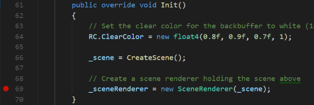
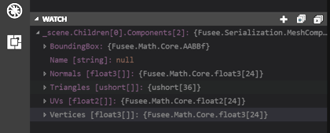
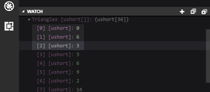
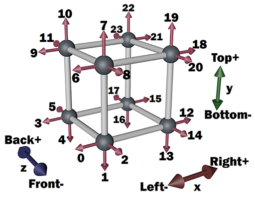

# Mesh

## Lernziele

- Mesh als Geometrie-Bausteine verstehen
  - Aufbau einer Mesh-Komponente
  - Algorithmisch Meshes erzeugen
  - Interaktiv und iterativ einen Algorithmus zur Erzeugung von Geometrie entwickeln.

## Meshes

In der Solution Mesh.sln wird ein einzelner rotierender Würfel wird angezeigt.

> **TODO** Zur Wiederholung/Übung/ zum Verständnis:
>
> - Identifiziert den Teil, der die Würfelanimation (Rotation) implementiert
>   - Was macht die Methode
>      [`M.MinAngle()`](https://github.com/FUSEEProjectTeam/Fusee/blob/develop/src/Math/Core/M.cs#L688)?
>      Warum wird sie aufgerufen?
> - An welcher Position und welcher Orientierung steht die Kamera? Die Anweisungen
>
>   ```C#
>   // Setup the camera
>   RC.View = float4x4.CreateTranslation(0, 0, 40) * float4x4.CreateRotationX(-(float) Atan(15.0 / 40.0));
>   ```
>
>   beschreiben von links nach rechts und jeweils mit negativ zu interpretierenden Parametern die Transformationen,
>   die auf die Kamera ausgeführt werden. Ausgehend von einer Kamera im Koordinaten-Ursprung `(0, 0, 0)`,
>   die entlang der positiven Z-Achse schaut, wird die Kamera zunächst um -40 Einheiten entlang der Z-Achse bewegt.
>   Anschließend wird die Kamera um den Winkel `Math.Atan(15.0 / 40.0)` um die X-Achse gedreht. Rotationen beziehen
>   sich dabei immer auf den Ursprung des Koordinatensystems und NICHT etwa auf den Mittelpunkt der
>   (ggf. bereits verschobenen) Kamera.
>
>   - Welchem Winkel in Grad entspricht [`Math.Atan(15.0 / 40.0)`](https://msdn.microsoft.com/en-us/library/system.math.atan(v=vs.110).aspx)?
>   - Zeichnet Position und Orientierung der Kamera und die Position des Würfels in einer Seitenansicht
>     (Y-Z-Achsen) des Weltkoordinatensystems auf.

Der Würfel wird, wie in den vorangegangenen Beispielen auch, als ein Objekt vom Typ
[`Mesh`](https://github.com/FUSEEProjectTeam/Fusee/blob/develop/src/Engine/Core/Scene/Mesh.cs#L10)
in die Komponentenliste eingehängt. Diese Komponente wird, gleich mit würfelförmiger Geometrie befüllt, von der
Methode `SimpleMeshes.CreateCuboid(new float3(10, 10, 10))` erstellt und zurückgegeben.
Wir wollen uns ansehen, woraus die Würfel-Geometrie besteht.

> **TODO**
>
> - Schaut Euch die Implementierung von
>   [`SimpleMeshes.CreateCuboid()`](SimpleMeshes.cs#L14)
>   an. _Tipp:_ Ihr könnte mit gedrückter `Strg`-Taste direkt im Visual Studio Code Editor auf den
>   Methodenaufruf klicken.
> - Seht Euch den Inhalt der Mesh-Komponente im Debugger an:
>   - In der Methode `Init()`: Setzt einen Breakpoint in die nächste Zeile unter den Aufruf von `_scene = CreateScene();`
>
>     
>
>     Dazu einfach mit der Maus in der grauen Spalte vor der entsprechenden Zeile klicken.
>
>   - Startet den das Programm wie üblich im Debugger über den grünen "Play"-Button (im Desktop Build).
>     *Ergebnis*: Der Programm-Ablauf hält am roten Breakpoint an.
>   - Öffnet das Watch-Fenster des Debuggers (In den **Debug-View** wechseln, in der **Watch**-Leiste auf das `+` klicken)
>     und fügt als zu beobachtende
>     Variable folgenden Ausdruck ein: `_scene.Children[0].Components[2]`. Es soll also die als **drittes**  
>     (Null-basierter Index; **2**) eingefügte Komponente des **ersten** Kindes (Null-basierter Index; **0**)
>     unserer Szene beobachtet werden. Das ist natürlich die Mesh-Komponente.
>
>     
>
>   - Diese enthält diverse Arrays, u.A: `Vertices`, `Normals` und `Triangles`. Klappt
>     die Arrays im Watch-Fenster auf und seht Euch die Inhalte an. Macht euch klar, dass dies
>     das Resultat des Aufrufs von
>     [`SimpleMeshes.CreateCuboid()`](SimpleMeshes.cs#L11
)
>     ist.

### Vertices

Wir wollen nun verstehen, wie diese Daten einen Würfel erzeugen. Zunächst mal betrachten wir den Inhalt
des `Vertices` Array. Wie uns der Name sagt, sind das die Eckpunkte unserer Geometrie, an denen die Flächen
aufgehängt sind. Wie wir sehen, sind dort 3D-Positionen angegeben und diese liegen alle 5 Einheiten
in jeweils beide möglichen Richtungen entlang jeder Hauptachse (x, Y und Z) vom Ursprung entfernt.

Damit liegen wohl alle Punkte an den Eckpunkten eines Würfels mit dem Zentrum in `(0, 0, 0)` und der Kantenlänge 10
(jeweils von -5 bis 5 - so haben wir es ja im Aufruf von `SimpleMeshes.CreateCuboid(new float3(10, 10, 10))`
angegeben).

> **TODO**
>
> - Falls das nicht klar ist, zeichnet ein paar der Vertices in ein 3D-Koordinatensystem ein.

Eine Frage stellt sich jedoch: Warum sind es 24 Array-Einträge? Ein Würfel hat doch nur 8 Eckpunkte und dies
ist auch die Anzahl der überhaupt möglichen unterschiedlichen Eckpunkte mit den Koordinaten "Betrag von 5 in
allen Dimensionen". Wie wir an den Array-Einträgen sehen, existiert jeder Eckpunkt dann auch drei mal.

Diese Frage, warum hier offenbar drei mal soviel Eckpunkte angegeben sind wie notwendig, klären wir unten,
wenn es um Normalen geht.

### Triangles

FUSEE versteht nur Meshes, die aus Dreiecken aufgebaut sind. Sollen Flächen mit mehr Eckpunkten dargestellt
werden, müssen diese aus Dreiecken zusammengepuzzelt werden. Da ein Würfel aus sechs Quadraten besteht, muss
jedes Quadrat aus zwei Dreiecken gebildet werden. Der Array `Triangles` enthält die Information, welche Eckpunkte
mit welchen anderen Eckpunkten im `Vertices`-Array Dreiecke bilden. Dazu wird der Inhalt des `Triangles`
folgendermaßen interpretiert:

- Der Array enthält 36 Einträge, allerdings keine 3D-Koordinaten, sondern Ganzzahl-Werte
  ([`ushort`](https://docs.microsoft.com/de-de/dotnet/articles/csharp/language-reference/keywords/ushort),
  ähnlich wie `int`).
  Wie man sieht, liegen diese Arrayeinträge im Bereich [0..23]. Diese Zahlen sind Indizes in den `Vertices`
  Array (und in den `Normals` Array, aber dazu später mehr...).
- Jeweils drei aufeinanderfolgende Indizes im Array bilden ein Dreieck, d.h. die ersten drei Einträge,
  `0`, `2` und `1` bedeuten, dass die an Positionen 0, 2, und 1 im `Vertices`-Array-abgespeicherten Eckpunkte
  ein Dreieck bilden. Dann kommen im `Triangles` array die drei Einträge `0`, `3` und `2`. Somit bilden
  die drei Punkte, die man an diesen Indizes im `Vertices`-Array findet, das nächste Dreieck.

  

> **TODO**
>
> - Zeichnet die ersten vier im `Triangles`-Array angegebenen Dreiecke (d.h. die ersten 12 Einträge verwenden!)
>   in ein 3D-Koordinatensystem ein.

Damit ist klar, dass die 36 Einträge insgesamt 12 Dreiecke (12 * 3 = 36) aufspannen. Das sind genau zwei Dreiecke,
um jede der sechs quadratischen Würfelflächen darzustellen.

### Normals

Wie in
[Lektion 5](https://sftp.hs-furtwangen.de/~lochmann/computergrafik2019/script/chapter05/lecture01/#normal-map-node)
angesprochen wurde, wird die Farbgebung der Oberflächen über
Normalenvektoren beeinflusst. Diese geben die Ausrichtung der Fläche im Raum an. Um gerundete Oberflächen
zu simulieren (indem kontinuierliche Farbverläufe wie bei gerundeten Flächen errechnet werden),
werden Normalen nicht pro Fläche oder pro Dreieck angegeben, sondern pro Eckpunkt. Somit enthält der
`Normals` Array genauso viel Einträge, wie der `Vertices` Array (nämlich 24). Korrespondierende Indizes in
beiden Array liefern die Koordinate und die Normale eines Eckpunktes. Da ein Würfel nicht aus gerundeten
sondern aus ebenen Flächen besteht, die an deutlich sichtbaren Kanten aufeinander stoßen sollen, muss jeder
Eckpunkt drei mal vorhanden sein, und zwar mit unterschiedlichen Normalen. Nur so können im
`Triangles`-Array Eckpunkte indiziert werden, die für die jeweilige Flächenausrichtung die passende Normale
besitzen. Folgende Skizze verdeutlicht den Aufbau des Würfels aus Eckpunkten und Normalen und gibt die Indizes
der Eckpunkte jeweils mit unterschiedlichen Normalen wieder.



> **TODO**
>
> - Sucht beliebige Indizes im 'Triangles'Array, findet jeweils den damit identifizierten Eckpunkt im 'Vertices'-Array
>   und die dazugehörende Normale im `Normals`-Array und vergleicht die Zahlenwerte mit der Skizze.

### UVs

Wie auch in Blender heißen Texturkoordinaten in FUSEE `UVs`.  Auch diese werden für jeden Eckpunkt angegeben. In dieser
Lektion spielen Texturkoordinaten keine Rolle.

## Ein eigenes Mesh

In der Aufgabe am Ende soll die Methode

```C#
SimpleMeshes.CreateCylinder(float radius, float height, int segments)
```

implementiert werden. Diese soll eine Mesh-Komponente in Form eines Zylinders erzeugen.
Eine Dummy-Implementierung existiert bereits in der Datei
[SimpleMeshes.cs](SimpleMeshes.cs#L127).
Im Unterschied zum Würfel ist die Mantelfläche des Zylinders gerundet. Das hat folgende Konsequenzen:

- Die Mantelfläche kann nur aus endlich vielen Segmenten bestehen. Die Anzahl der Segmente soll aber
  durch den Benutzer vorgegeben werden. Somit müssen sowohl die Mantelfläche als auch die beiden
  Deckflächen mit Hilfe einer Schleife erzeugt werden, bei der die Anzahl der Durchläufe durch den
  Parameter `segments` bestimmt wird.
- Die Normalen rund um die Mantelfläche müssen zu einem kontinuierlichen (_smooth_) Shading führen

### Zylinder-Aufbau

Das folgende Bild verdeutlicht den Aufbau eines Zylinders.


Bis auf die beiden Mittelpunkte der Deckflächen müssen alle Eckpunkte doppelt angegeben werden, da sie jeweils
Bestandteil zweier unterschiedlicher Flächen mit unterschiedlichen Ausrichtungen (Normalen) sind.

Zunächst soll ein Algorithmus entwickelt werden, der eine kreisförmige Deckfläche des Zylinders als Fächer von
Dreiecken aufspannt. Die Anzahl der Dreiecke - die Segmente, die später die tortenstückartigen Einzelteile des Zylinders
werden - soll dabei vom Benutzer bestimmt werden.

### Idee des Algorithmus

Die folgende Skizze soll uns helfen, den Algorithmus aufzubauen.


> **TODO**
>
> - Vergegenwärtigt Euch mit Hilfe der Skizze folgende Sachverhalte (diese sollten verstanden sein)
>   - Das Beispiel erzeugt acht Segmente (der Parameter `segments` wäre hier also 8.
>   - Wir schauen von oben auf die X-Z-Ebene. Das Beispiel soll also zunächst die obere Deckfläche erzeugen.
>   - Die Kreisfläche soll ihren Mittelpunkt bei (0, 0, 0) haben.
>   - Der Radius ist durch den Parameter `radius` beim Methodenaufruf gegeben und ist in der Skizze mit `r` benannt.
>   - Der Kreis wird in `segments` (hier 8) Teile unterteilt. Jedes "Kuchenstück" spannt einen Winkel von
>     360°/`segments`, bzw. im Bogenmaß: 2π/`segments` auf. Dieser Wert wird in der Skizze mit Delta (δ) benannt.
>     Wieviel Grad beträgt δ, wenn, wie in der Skizze, `segments` == 8?
>   - Ein Punkt auf dem Kreis an einem beliebigen Winkel α von der X-Achse aus gemessen hat folgende Koordinaten:
>     - x: r * cos α
>     - z: r * sin α
>
>     Erklärung: Wenn man das Lot vom Punkt auf die X-Achse zeichnet, ergibt sich ein rechtwinkliges Dreieck.
>     Das ist für Punkt 1 in der Skizze als gestrichelte Linie eingezeichnet. In diesem Dreieck ist
>     der Radius die Hypothenuse und die x- und z-Koordinaten sind die Katheten. Die Formel gilt nicht nur
>     im ersten Quadranten des Koordinatensystems, sondern in allen vier, also auch bei Winkeln α > 90°!
> - Zeichnet die für noch nicht blau markierten Vertices deren Indizes in die Skizze ein.
> - Rechnet für ein paar der Punkte deren Koordinaten nach o.g. Formel aus.
> - Zeichnet eine vergleichbare Skizze mit einem anderen Wert als 8 für `segments`, z.B. 5, 6, 7 oder 9. Wie groß
>   ist dann δ?

### Die zentrale Schleife

Es ist klar, dass das Erstellen der Punkte in einer Schleife stattfinden muss, denn zur Compile-Zeit der Methode ist nicht
bekannt, wie groß der Parameter `segments` sein wird. Wir verwenden eine Schleife mit einer Zählvariablen `i`, die
nicht - wie sonst üblich - bei 0 losläuft, sondern bei 1. Der letzte Schleifendurchlauf läuft für `i == segements-1`,
in unserem Beispiel läuft die Schleife also sieben mal, mit i von 1 bis einschließlich 7. In der Skizze ist `i` jeweils
als weiße Zahl auf blauem Grund angegeben.

> **TODO**
>
> - Beginnt die Implementierung von `CreateCylinder` wie folgt:
>
>  ```C#
>    public static Mesh CreateCylinder(float radius, float height, int segments)
>    {
>        for (int i = 1; i < segments; i++)
>        {
>        }
>
>        return new Mesh
>        {
>        };
>    }
>  ```
>

### Initialisierungen

Noch passiert in der Schleife nichts. Ebenso ist die zurückgegebene Mesh-Komponente noch leer. Wir
wissen bereits folgendes:

- Bei n Segmenten benötigen wir n+1 `Vertices` (denn der Mittelpunkt kommt noch dazu).
  In der Skizze ist `segments` 8 und es gibt 9 Vertices inklusive Mittelpunkt).
- Für die Dreiecksflächen benötigen wir im `Triangles`-Array drei Indizes pro Fläche,
  insgesamt sind es also `segments * 3` Einträge im `Triangles`-Array.
- Schließlich muss es noch genau gleich viele Einträge im `Normals`-Array wie im `Vertices`-Array geben.

> **TODO**
>
> - Legt am Anfang der Methode (_vor_ der Schleife) drei Arrays an, in denen die Vertices, die Triangles-Indizes
>   und die Normalen gespeichert werden.
>
>  ```C#
>    float3[] verts = new float3[segments+1];    // one vertex per segment and one extra for the center point
>    float3[] norms = new float3[segments+1];    // one normal at each vertex
>    ushort[] tris  = new ushort[segments * 3];  // a triangle per segment. Each triangle is made of three indices
>  ```
>
> - Tragt am Ende der Methode diese Arrays als die aktuell zurückzugebenden Einträge der neuen
>   Mesh-Komponente ein:
>
>  ```C#
>   return new Mesh
>   {
>       Vertices = verts,
>       Normals = norms,
>       Triangles = tris,  
>   };
>  ```

Die Schleife läuft bei 1 los (und nicht bei 0), da wir pro Schleifendurchlauf jeweils nicht nur die Koordinaten
des jeweiligen Punktes mit dem Index `i` errechnen wollen, sondern auch gleich den `tris`-Array mit Indizes für
das jeweilige Segment füllen wollen. Für das erste Segment, das aus den Indizes `8`, `0` und `1` besteht, muss
aber der Punkt mit dem Index 0 bereits bestehen. Deswegen muss _vor_ der Schleife (und _nach_ dem Erzeugen der
Arrays), noch ein wenig Initialisierungsarbeit geleistet werden.

> **TODO**
>
> - Errechnet zunächst vor der Schleife den Winkel δ (im Bogenmaß):
>
>   ```C#
>      float delta = 2 * M.Pi / segments;
>   ```
>
>   _Fun Fact_ :-): C#-Dateien sind in Unicode gespeichert, d.h. es könnten u.A. auch griechische Buchstaben
>   als Variablennamen verwendet werden. Folgender Code ginge auch, ist aber unpraktisch, weil schwer zu tippen...
>
>   ```C#
>      float δ = 2 * M.Pi / segments;
>   ```
>
> - Fügt direkt vor die Schleife die Initialisierung des letzten Punktes im Array ein, der immer im
>   Koordinatenursprung `(0, 0, 0)` oder `float3.Zero` liegt. Die Normalen _aller_ Eckpunkte der oberen
>   Deckfläche zeigen "nach oben", also entlang der positiven Y-Achse (`(0, 1, 0)` oder `float3.UnitY`).
>
>   ```C#
>      // The center (store at the last position in the vertex array (index 'segments'))
>      verts[segments] = float3.Zero;
>      norms[segments] = float3.UnitY;
>   ```
>  
> - Da die Schleife bei 1 (und nicht bei 0) losgeht: Fügt - ebenfalls vor der Schleife - die die Initialisierung
>   des Punktes 0 ein. Dieser liegt auf der X-Achse (d.h. `z`= 0) mit dem Abstand `radius` vom Nullpunkt. Auch
>   dieser Punkt braucht eine Normale:
>
>    ```C#
>      // The first and last point (first point in the list (index 0))
>      verts[0] = new float3(radius, 0, 0);
>      norms[0] = float3.UnitY;
>    ```
>
>    Dieser Punkt 0 wird gleichzeitig auch Bestandteil des letzten Kuchenstücks, aber dazu später mehr.

### Schleifenrumpf: Punktkoordinaten berechnen

Jetzt können wir in der Schleife die Koordinaten aller Punkte von 1..segements-1 (in der Skizze von 1 bis 7) errechnen
und diese im `verts`-Array jeweils an der Stelle `i` abspeichern.

> **TODO**
>
> - Fügt die Berechnung der Koordinaten für Punkt `i` in den Schleifenrumpf ein
>
>   ```C#
>   for (int i = 1; i < segments; i++)
>   {
>       // Create the current point and store it at index i
>       verts[i] = new float3(radius * M.Cos(i * delta), 0, radius * M.Sin(i * delta));
>       norms[i] = float3.UnitY;
>   }
>   ```

Damit sollte die Methode alle benötigten Punkte und Normalen an die richtigen Stellen in den Arrays `Normals`
und `Vertices` unserer Mesh-Komponente eintragen. Natürlich wird noch keine sichtbare Geometrie erzeugt, denn
die Information, welche Punkte mit welchen anderen Punkten zu Dreiecken zusammengefasst werden, fehlt noch.

Wir können aber mit dem Debugger überprüfen, ob soweit alles stimmt:

> **TODO**
>
> - In der Methode `CreateScene()` (Datei Mesh.cs) Ersetzt den Aufruf von `SimpleMeshes.CreateCuboid()` durch
>
>   ```C#
>      // MESH COMPONENT
>      SimpleMeshes.CreateCylinder(5, 10, 8)
>   ```
>
>   _Kontrollfrage_: Wenn durch diesen Aufruf bereits ein sichtbarer Zylinder erzeugt würde, wie groß wäre dieser?
>
> - Startet den Debugger. Falls der Breakpoint nicht mehr gesetzt ist, setzt diesen Erneut _nach_ dem Aufruf
>   von `CreateScene()` und begutachtet dann wie beim Würfel den Inhalt der Mesh-Komponente (siehe oben).
>
> - Überzeugt euch, dass
>   - die Arrays `Vertices` und `Normals` jeweils neun Einträge enthalten.
>   - Alle Einträge im `Normals` Array den "Hoch-Vektor" `(0, 1, 0)` enthalten.
>   - Die Einträge 0..7 im `Vertices` Array auf einem Kreis mit dem Radius 5 liegen. Das sollte vor allem für
>     die Koordinatenwerte der Punkte an den Indizes 0, 2, 4 und 6 gut sichtbar sein (Warum? Antwort siehe Skizze).
>   - Der Eintrag am Index 8 im `Vertices` Array im Koordinatenursprung liegt.

### Dreiecksliste erzeugen

Wenn mit "F5" oder "Continue" der Programmlauf nach dem Breakpoint fortgesetzt wird, erscheint keine Geometrie,
denn es sind keine Dreiecke vorhanden. Diese müssen wir jetzt noch einfügen. Dazu soll bei jedem Schleifendurchlauf
die zu `i`  zugehörigen drei Eckpunkt-Indizes in den `tris`-Array eingetragen werden. Für unser Beispiel mit 8 Segmenten
gilt folgende Zuordnung

| Schleifendurchlauf / Vertex-Index  | Indizes der Segment-Eckpunkte |
|:----------------------------------:|:-----------------------------:|
| 1 | 8, 1, 0 |
| 2 | 8, 2, 1 |
| 3 | 8, 3, 2 |
| 4 | 8, 4, 3 |
| 5 | 8, 5, 4 |
| 6 | 8, 6, 5 |
| 7 | 8, 7, 6 |
| `i` | 8, `i`, `i-1` |

> **TODO**
>
> - Erklärt Euch den Inhalt der obigen Tabelle anhand der Skizze
>
> - Fügt folgenden Code in den Schleifenrumpf ein:
>
>   ```C#
>      // Stitch the current segment (using the center, the current and the previous point)
>      tris[3*i - 1] = (ushort) segments; // center point
>      tris[3*i - 2] = (ushort) i;        // current segment point
>      tris[3*i - 3] = (ushort) (i-1);    // previous segment point
>   ```
>
> - Setzt einen Breakpoint in die Schleife und schaut, wie aus den obigen Anweisungen die in der Tabelle
>   stehenden Indizes berechnet werden und an die richtigen Stellen im `tris`-Array gespeichert werden.
>
> - Betrachtet nach dem Schleifendurchlauf den Inhalt des `tris`-Array und überzeugt Euch, dass der Inhalt
>   korrekt ist.

Lasst den Code laufen. Nun sollte das Achteck als Annäherung des Kreises bis auf das letzte Segment erscheinen
(das graue Feld in der Skizze fehlt). Das letzte Segment können wir nicht innerhalb der Schleife erzeugen, denn

- die Punkte-Indizes lassen sich nicht nach obiger Regel aus `i` berechnen,
- das Segment wird aus dem letzten Punkt auf dem Kreis (7) und dem allerersten (0) zusammengesetzt.


## Aufgabe

### Teil 1

- Testet den Code für unterschiedliche Werte für `segments` und macht euch klar, dass jeweils nur das letzte Dreieck fehlt.
- Fügt die Vermaschung für das letzte Dreieck _nach der Schleife_ hinzu, so dass der Zylinder-Boden geschlossen erscheint. Für das
  letzte Dreieck müssen nur Einträge in den `tris`-Array erfolgen. Alle nötigen Punkte für das letzte Dreieck sind bereits
  im `verts`-Array enthalten.
- Wählt einen kleinen Wert für `segments` und zeichnet ein Bild mit den Vertices und den Dreiecken des entstehenden Zylinder-Bodens.
  Schreibt die Array-Inhalte für `verts` und `tris` auf. Zeichnet Verbindungslinien zwischen der Boden-Skizze und den Array-Inhalten,
  die erklären, wie die Array-Inhalte die Geometrie beschreiben.

Hinweise: Die Abgabe muss den Code aus SimpleMeshes.cs enthalten. Scannt/fotografiert Eure Skizze und legt diese der Abgabe als Bild/Pdf hinzu.

### Teil 2

Der bis hierher erarbeitete Code soll nun so erweitert werden, dass ein Zylinder entsteht.

In dieser Übung sollen - neben dem Verständnis für Geometriedaten - auch Herangehensweisen an komplexe Aufgaben
geübt werden. Es ist klar, das vieles nicht auf Anhieb funktioniert. Wichtig ist, dass man sich Strategien
zur Fehleranalyse aneignet. Einen ersten Versuch zusammenhacken, ausprobieren, merken, dass es nicht geht und
dann aufgeben gehört nicht dazu. Dazu gehört:

- In kleinen Schritten arbeiten und Zwischenergebnisse testen.
- Skizzen anfertigen
- von Hand ausrechnen, was zu erwarten ist, dann im Debugger die Daten analysieren,
- Code-Teile auskommentieren, auf Verdacht abändern
- Parameter ändern (z.B. mal mit 3 oder 4 statt 8 Segmenten testen) und das Ergebnis interpretieren

### Tipps und Hinweise

Hier zunächst ein paar beachtenswerte Tatsachen und Hinweise:

- Ziel sollte es sein, den Algorithmus nach wie vor mit nur einer Schleife aufzubauen, in der die Zählvariable `i`
  die Segmente durchnummeriert.

- Wie im Abschnitt [Zylinder-Aufbau](#zylinder-aufbau) zu sehen ist, muss jeder Randpunkt zwei mal vorhanden sein
  - einmal für die Deckfläche mit der Normalen nach oben (bzw. unten für die untere Deckfläche).
  - einmal für die Mantelfläche mit der Normalen radial in der selben Richtung, die der Punkt vom Ursprung
    entfernt liegt. Der Normalenvektor für diese Punkte lässt sich also
    [genauso](#idee-des-algorithmus) berechnen, wie die Punkt-Koordinate
    selbst, nur, dass der Normalenvektor die Länge 1 haben soll und somit nicht mit dem Radius multipliziert werden
    muss:
    - x_normale: cos i*δ
    - z_normale: sin i*δ
    - y_normale: 0 (***IMMER***)

- Somit beträgt der Punktebedarf für den gesamten Zylinder: `4*segments + 2`. Pro Segment-Kante vier Punkte:

  - einer für die obere Deckfläche (Normale nach oben)
  - einer für den oberen Rand des Mantelflächenabschnittes (Normale horizontal)
  - einer für den unteren  Rand des Mantelflächenabschnittes (Normale horizontal)
  - einer für die untere Deckfläche (Normale nach unten)
  Zusätzlich die beiden Mittelpunkte der oberen und unteren Deckfläche.

- Die Array-Größe für `tris` für den vollständigen Zylinder beträgt `4 * 3 * segments`:
  - Jede der zwei Deckfläche besteht aus `segments` Dreiecken: `2 * 3 * segments` Einträge für die Deckflächen.
  - Jedes Segment der Mantelfläche besteht aus einem Viereck, das aus zwei Dreiecken aufgebaut werden muss:
    `2 * 3 * segments` Einträge für die Mantelfläche.

- Die untere Deckfläche kann analog zur oberen aufgebaut werden, allerdings müssen die Dreiecke in umgekehrter
  Umlaufrichtung im `tris`-Array angegeben werden, damit sie nach außen hin sichtbar sind. Dreiecke sind immer
  nur aus der Richtung sichtbar, aus der ihre Eckpunkte in umgekehrtem Uhrzeigersinn auf dem Bildschirm erscheinen.

- Die Y-Koordinate der Eckpunkte der oberen Deckfläche/des oberen Mantelrandes soll bei `0.5f * height` liegen,
  die der Unterseiten-Punkte soll bei `-0.5f * height` liegen.

- Empfohlen wird folgende Punktanordnung in den `verts`- und `norms`-Arrays:
  - Die beiden Mittelpunkte der beiden Deckflächen sollten ans Ende der Arrays (Indizes `4*segments` (oben)
    und `4*segments+1` unten).
  - Jeweils vier aufeinanderfolgende Punkte im Array bilden die vier Punkte einer Segment-Kante in
    dieser Reihenfolge:
    - `verts[4*i + 0]`: obere Deckfläche,
    - `verts[4*i + 1]`: oberer Mantelrand,
    - `verts[4*i + 2]`: unterer Mantelrand,
    - `verts[4*i + 3]`: untere Deckfläche,

- Empfohlen wird folgende Anordnung der Indizes im `tris` Array: Jeweils 12 aufeinanderfolgende Einträge bilden
  die vier Dreiecke eines Segmentes in folgender Reihenfolge:
  - Dreieck des oberen Deckflächensegmentes (drei Einträge)
  - erstes Dreieck des viereckigen Mantelflächensegmentes (drei Einträge)
  - zweites Dreieck des viereckigen Mantelflächensegmentes (drei Einträge)
  - Dreieck des unteren Deckflächensegmentes (drei Einträge)

- Somit ergeben sich für jedes Segment `i` (nach der Nummerierung in o.a. Skizze) folgende Beziehungen
  zwischen `tris`-Array und `verts`-  (bzw. `norms`-) Array:

   ```C#
      // top triangle
      tris[12*(i-1) + 0] = (ushort) 4*segments;       // top center point
      tris[12*(i-1) + 1] = (ushort) 4*i     + 0;      // current top segment point
      tris[12*(i-1) + 2] = (ushort) 4*(i-1) + 0;      // previous top segment point

      // side triangle 1
      tris[12*(i-1) + 3] = (ushort) 4*(i-1) + 2;      // previous lower shell point
      tris[12*(i-1) + 4] = (ushort) 4*i     + 2;      // current lower shell point
      tris[12*(i-1) + 5] = (ushort) 4*i     + 1;      // current top shell point

      // side triangle 2
      tris[12*(i-1) + 6] = (ushort) 4*(i-1) + 2;      // previous lower shell point
      tris[12*(i-1) + 7] = (ushort) 4*i     + 1;      // current top shell point
      tris[12*(i-1) + 8] = (ushort) 4*(i-1) + 1;      // previous top shell point

      // bottom triangle
      tris[12*(i-1) + 9]  = (ushort) 4*segments+1;    // bottom center point
      tris[12*(i-1) + 10] = (ushort) 4*(i-1) + 3;     // current bottom segment point
      tris[12*(i-1) + 11] = (ushort) 4*i     + 3;     // previous bottom segment point
   ```

### Einzelschritte

1. Verändert im bestehenden Code alle Vertex-Koordinaten so, dass diese um `0.5f * height` Einheiten entlang der Y-Achse    nach oben verschoben werden (Mittelpunkt nicht vergessen).

2. Erweitert die Arrays auf die o.A. Größen und verändert zunächst die Berechnungen der bestehenden Indizes nach
   obigem Schema, so dass nach wie vor nur die obere Deckfläche angelegt wird, allerdings schon an den endgültigen
   Array-Positionen in `tris`, `norms` und `verts`.

3. Fügt Vertices und Dreickslisteneinträge für die untere Deckfläche hinzu. Zur visuellen Kontrolle könnt
   Ihr den Zylinder um seine X- statt um seine Y-Achse rotieren lassen.

4. Fügt Vertices und Dreickslisteneinträge für die Mantelfläche hinzu.

5. Falls noch nicht geschehen: Fügt das Dreiecksvermaschen für alle Flächen des letzten Segmentes außerhalb der
   Schleife hinzu.

### Alternativen / Ausblick / Für Fortgeschrittene

Wem der Einstieg zu schwierig ist und wer noch etwas mehr Sicherheit mit den Grundlagen benötigt, sollte zunächst mal versuchen,
die Methode `SimpleMeshes.CreateTetrahedron()` oder `SimpleMeshes.CreatePyramid()` zu implementieren. Bei beiden
Körpern steht, wie beim Cuboid, zur Compile-Zeit fest, aus wieviel Punkten und Flächen sie bestehen. Somit kann
ohne Schleifen und variable Indexberechnung gearbeitet werden. Stattdessen können, wie beim Cuboid, direkt die Punkte
und Flächen ein die entsprechenden Arrays eingetragen werden und die Indizes direkt als Zahlenwerte eingetragen werden.

Wer mit dem Zylinder gut zurecht kam, kann sich überlegen, wie aus den dabei gewonnenen Erkenntnissen die Methoden
`SimpleMeshes.CreateConeFrustum()` (leicht) oder auch die Methode `SimpleMeshes.CreateTorus()` (schwerer) implementiert
werden können.
